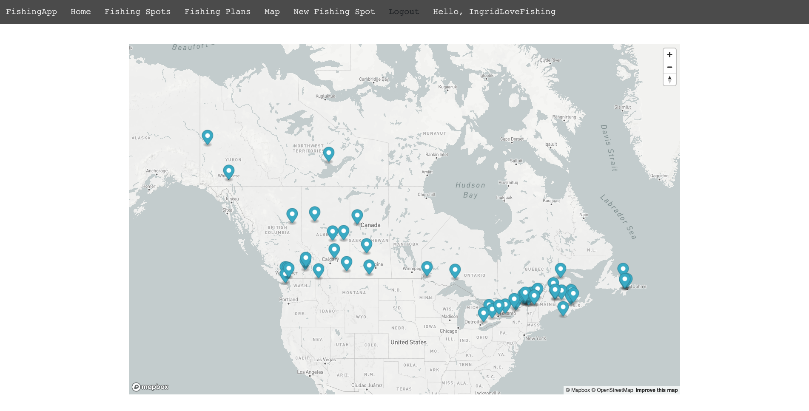

# FishingApp

This react app is the final project for Concordia Uni's full-stack web development bootcamp.It allows the user to add new fishing spots to the world map, submit fishing plans and participate other user’s fishing plans.

Technologies: 
React.js, Styled Components, bootstrap, CSS, Node.js, MongoDB, Express

#### The homepage of the fishing app

#### The fishing spot index page
I have generate some fishing spots with different names, different location, the same description and the same image.

#### Create a new fishing spot

In order to create new fishing spot, I register as user: IngridLoveFishing.
Then I create a new fishing spot, like this:

#### The fishing spot detail page
Here is the newly created fishing spot:

#### Fishing plan
Users can create fishing plan based on different fishing spots:

And this is the new fishing plan at the new fishing spot:

Users can edit & delete their own fishing plan and participate other user's fishing plan:

#### Map page
The map page shows all the fishing spots in the database:

#### As the admin of the app

##### There are two differents types users: general user and admin. Genaral users can only edit & delete the fishing spots/fishing plan they created. Admin can edit & delete everything. 
Currently the only admin of this app is user: ingrid

If log in the admin account:

The admin can edit/delete any fishing spot:

And for the fishing plans, the admin can not only edit/delete any fishing plan but also send email to the author to tell him/her that the plan have enough participants:

Also, the admin can delete general user if they want:

##### Thanks for your time to view my project:)
